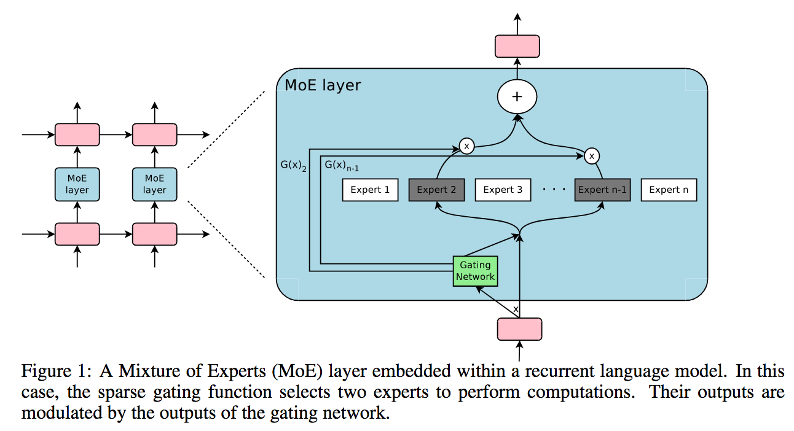

</img>

## Sparsely Gated Mixture of Experts - Pytorch

A Pytorch implementation of Sparsely Gated <a href="https://arxiv.org/abs/2006.16668">Mixture of Experts</a>, for massively increasing the capacity (parameter count) of a language model while keeping the computation constant.

It will mostly be a line-by-line transcription of the tensorflow implementation <a href="https://github.com/tensorflow/tensor2tensor/blob/master/tensor2tensor/models/research/moe.py">here</a>, with a few enhancements.

[](https://badge.fury.io/py/mixture-of-experts)

## Install

```bash
$ pip install mixture_of_experts
```

## Usage

```python
import torch
from torch import nn
from mixture_of_experts import MoE

moe = MoE(
    dim = 512,
    num_experts = 16,               # increase the experts (# parameters) of your model without increasing computation
    hidden_dim = 512 * 4,           # size of hidden dimension in each expert, defaults to 4 * dimension
    activation = nn.LeakyReLU,      # use your preferred activation, will default to GELU
    second_policy_train = 'random', # in top_2 gating, policy for whether to use a second-place expert
    second_policy_eval = 'random',  # all (always) | none (never) | threshold (if gate value > the given threshold) | random (if gate value > threshold * random_uniform(0, 1))
    second_threshold_train = 0.2,
    second_threshold_eval = 0.2,
    capacity_factor_train = 1.25,   # experts have fixed capacity per batch. we need some extra capacity in case gating is not perfectly balanced.
    capacity_factor_eval = 2.,      # capacity_factor_* should be set to a value >=1
    loss_coef = 1e-2                # multiplier on the auxiliary expert balancing auxiliary loss
)

inputs = torch.randn(4, 1024, 512)
out, aux_loss = moe(inputs) # (4, 1024, 512), (1,)
```

The above should suffice for a single machine, but if you want a heirarchical mixture of experts (2 levels), as used in the GShard paper, please follow the instructions below

```python
import torch
from mixture_of_experts import HeirarchicalMoE

moe = HeirarchicalMoE(
    dim = 512,
    num_experts = (4, 4),       # 4 gates on the first layer, then 4 experts on the second, equaling 16 experts
)

inputs = torch.randn(4, 1024, 512)
out, aux_loss = moe(inputs) # (4, 1024, 512), (1,)
```

1 billion parameters

```python
import torch
from mixture_of_experts import HeirarchicalMoE

moe = HeirarchicalMoE(
    dim = 512,
    num_experts = (22, 22)
).cuda()

inputs = torch.randn(1, 1024, 512).cuda()
out, aux_loss = moe(inputs)

total_params = sum(p.numel() for p in moe.parameters())
print(f'number of parameters - {total_params}')
```

If you want some more sophisticated network for the experts, you can define your own and pass it into the `MoE` class as `experts`

```python
import torch
from torch import nn
from mixture_of_experts import MoE

# a 3 layered MLP as the experts

class Experts(nn.Module):
    def __init__(self, dim, num_experts = 16):
        super().__init__()
        self.w1 = nn.Parameter(torch.randn(num_experts, dim, dim * 4))
        self.w2 = nn.Parameter(torch.randn(num_experts, dim * 4, dim * 4))
        self.w3 = nn.Parameter(torch.randn(num_experts, dim * 4, dim))
        self.act = nn.LeakyReLU(inplace = True)

    def forward(self, x):
        hidden1 = self.act(torch.einsum('end,edh->enh', x, self.w1))
        hidden2 = self.act(torch.einsum('end,edh->enh', hidden1, self.w2))
        out = torch.einsum('end,edh->enh', hidden2, self.w3)
        return out

experts = Experts(512, num_experts = 16)

moe = MoE(
    dim = 512,
    num_experts = 16,
    experts = experts
)

inputs = torch.randn(4, 1024, 512)
out, aux_loss = moe(inputs) # (4, 1024, 512), (1,)
```

## Citation

```bibtex
@misc{shazeer2017outrageously,
    title   = {Outrageously Large Neural Networks: The Sparsely-Gated Mixture-of-Experts Layer},
    author  = {Noam Shazeer and Azalia Mirhoseini and Krzysztof Maziarz and Andy Davis and Quoc Le and Geoffrey Hinton and Jeff Dean},
    year    = {2017},
    eprint  = {1701.06538},
    archivePrefix = {arXiv},
    primaryClass = {cs.LG}
}
```

```bibtex
@misc{lepikhin2020gshard,
    title   = {GShard: Scaling Giant Models with Conditional Computation and Automatic Sharding},
    author  = {Dmitry Lepikhin and HyoukJoong Lee and Yuanzhong Xu and Dehao Chen and Orhan Firat and Yanping Huang and Maxim Krikun and Noam Shazeer and Zhifeng Chen},
    year    = {2020},
    eprint  = {2006.16668},
    archivePrefix = {arXiv},
    primaryClass = {cs.CL}
}
```
